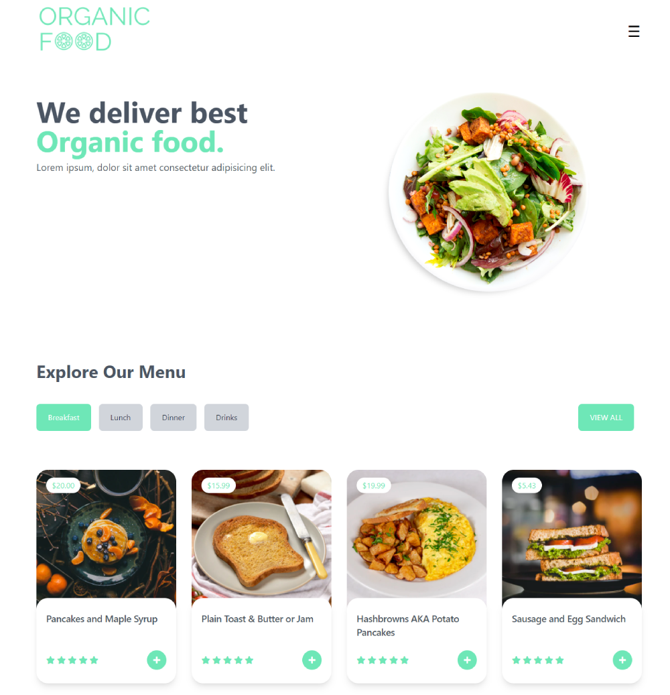

# Organic Food - Landing Page 🥗

Landing page built with Tailwind CSS.

## Table of contents 📑

- [Overview](#overview)
  - [The project](#the-challenge)
  - [Links](#links)
- [My process](#my-process)
  - [Built with](#built-with)
  - [What I learned](#what-i-learned)
  - [Useful resources](#useful-resources)
- [Author](#author)

## Overview 🔎

### The project

Simple landing page of a Restaurant called Organic Food where you can explore the different dishes and drinks.

### Links

📌 Live site URL: [here](https://g3rardogo.github.io/organic-food/public/home.html)

## My process 👨‍💻

### Built with

- Semantic HTML5 markup.
- Flexbox.
- CSS Grid.
- Mobile-first workflow.
- [Git](https://git-scm.com/) - Version control system.
- [Tailwind CSS](https://tailwindcss.com/) - CSS framework.
- [PostCSS](https://postcss.org/) - CSS preprocessor and post processor.
- [Autoprefixer](https://www.npmjs.com/package/autoprefixer) - PostCSS plugin to parse CSS and add vendor prefixes.
- [PurgeCSS](https://purgecss.com/) - Tool to remove unused CSS.
- [CSSNano](https://cssnano.co/) - CSS minifier.

### What I learned

This is a project built as a practice of Tailwind CSS. On the other hand, it's my first time using PostCSS with plugins. I really liked the final result of the styles using these tools.

### Useful resources

- [Tailwind CSS vs Bootstrap](https://themesberg.com/blog/design/tailwind-css-vs-bootstrap) - Learn the differences between the most popular CSS frameworks. 🥊
- [What is Tailwind CSS](https://dev.to/wizardhealth/tailwind-css-29p3) - If you don't know what is Tailwind, these is a interesting article. 🎨
- [7 PostCSS Plugins to Ease You into PostCSS](https://www.sitepoint.com/7-postcss-plugins-to-ease-you-into-postcss/) - Useful article if you are beginner with PostCSS' plugins. 🔌

## Author 🐱‍👤

- Website - https://gerardoramirez.netlify.app/
- Twitter - [@g3rardogo](https://twitter.com/g3rardogo)
